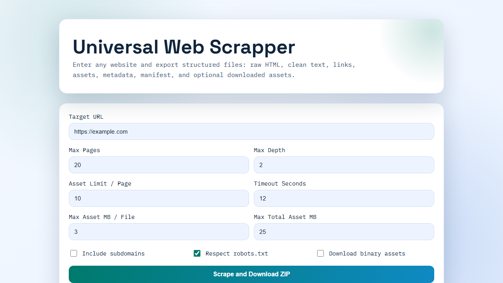

# Universal Web Scrapper

Universal Web Scrapper is a production-ready Next.js application that crawls websites and exports the extracted content into a clean, structured ZIP archive.

Live app: https://universal-webscrapper.vercel.app

## Prerequisites

- Node.js 20+
- npm 10+

## Interface Preview



This screenshot shows the main dashboard where you configure a crawl job:
- set the target URL
- control page/depth limits
- tune timeout and asset budgets
- toggle subdomain crawling, `robots.txt` compliance, and binary asset download
- start extraction and download the generated ZIP archive

## What it does

- Crawls pages starting from a target URL
- Follows internal links with configurable limits
- Extracts and organizes content per page
- Optionally downloads site assets (images, scripts, styles, media, docs)
- Exports everything as a single ZIP

## Core features

- Configurable crawl depth and page count
- Optional subdomain crawling
- Optional `robots.txt` compliance
- Request timeout controls
- Asset download controls:
  - max assets per page
  - max size per asset file
  - max total asset download budget
- Structured export that is easy to process in scripts/pipelines

## ZIP structure

```text
manifest.json
site/
  urls.txt
  robots.txt (optional)
  sitemap.xml (optional)
pages/
  0001_root/
    raw.html
    text.txt
    meta.json
    links.json
    assets.json
    downloaded-assets.json (optional)
assets/
  0001_root/
    0001.png
    0002.css
    ...
```

## Tech stack

- Next.js 15 (App Router)
- TypeScript
- Axios
- Cheerio
- JSZip
- p-limit
- robots-parser

## Run locally

### 1. Install dependencies

```bash
npm install
```

### 2. Start development server

```bash
npm run dev
```

Open `http://localhost:3000`.

### 3. Quality checks

```bash
npm run lint
```

### 4. Production build

```bash
npm run build
npm run start
```

## API

### `POST /api/scrape`

Request body example:

```json
{
  "url": "https://example.com",
  "maxPages": 20,
  "maxDepth": 2,
  "includeSubdomains": false,
  "respectRobots": true,
  "downloadAssets": false,
  "assetLimitPerPage": 10,
  "maxAssetMbPerFile": 3,
  "maxTotalAssetMb": 25,
  "timeoutSeconds": 12
}
```

Response:
- `200 OK` with `application/zip` attachment
- `4xx/5xx` with JSON error payload

## Deploy to Vercel

```bash
npm i -g vercel
vercel
vercel --prod
```

## Notes

- Use responsibly and respect target website terms/policies.
- Very large crawls may hit serverless limits; tune limits in the UI/API.

## License

MIT
